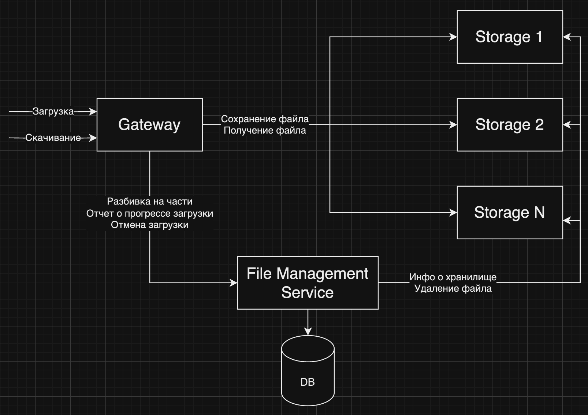
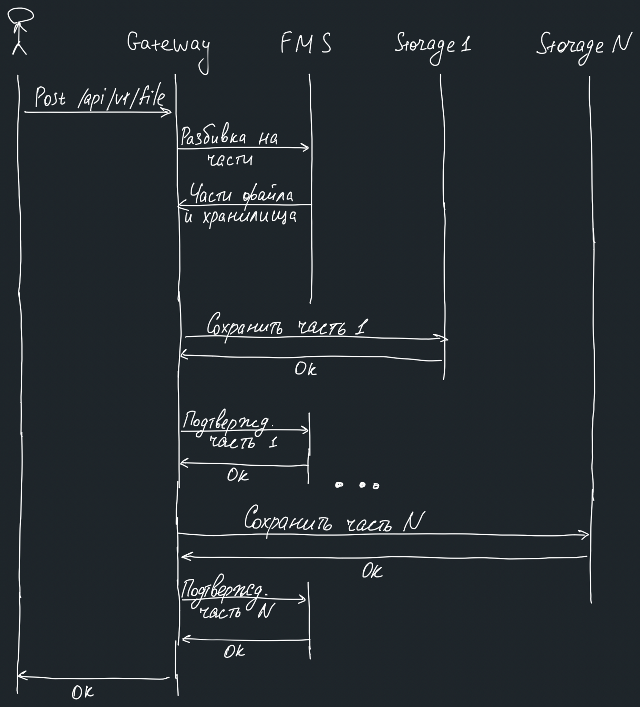
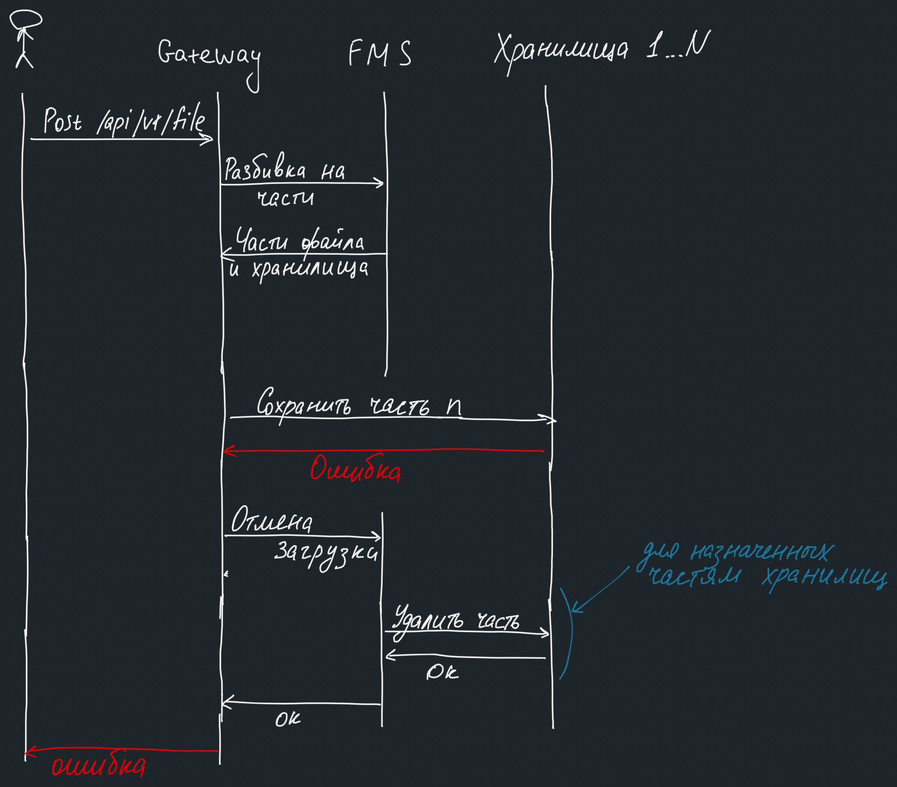
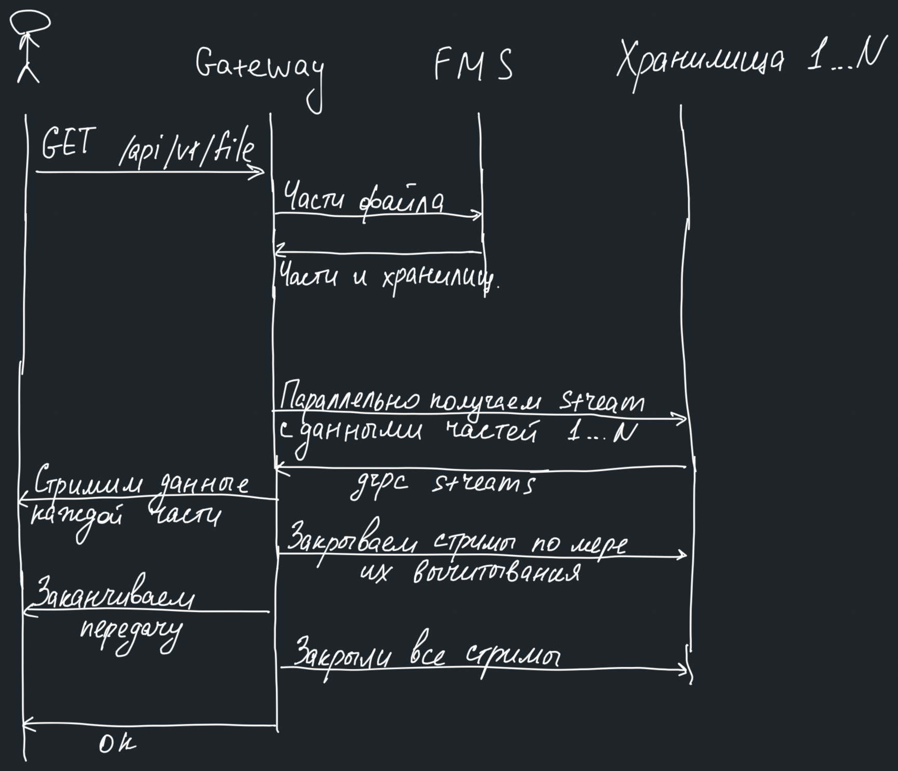
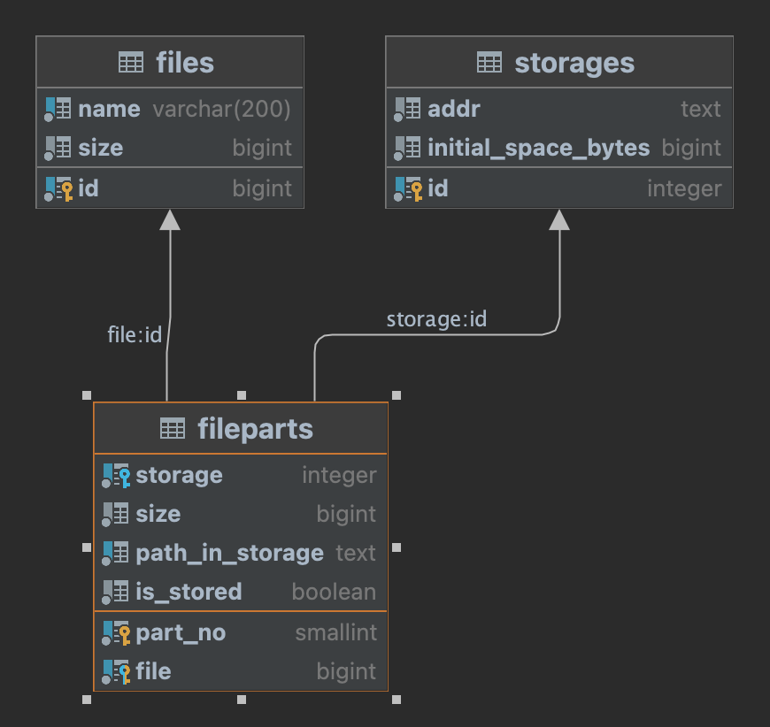
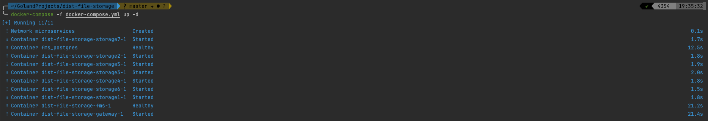
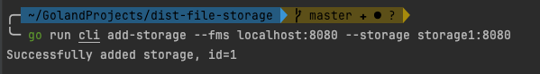
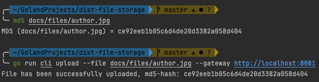
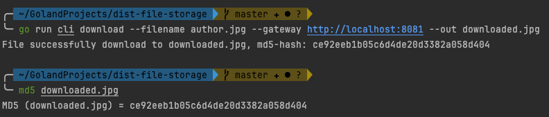

# Distributed File Storage

by Vislovich Vladimir

## Содержание

- [Краткое описание](#краткое-описание)
- [Архитектура](#архитектура)
- [Элементы системы](#элементы-системы)
- [Схемы взаимодействия](#схемы-взаимодействия)
    - [Успешная загрузка файлов](#успешная-загрузка-файлов)
    - [Загрузка файл с ошибкой](#загрузка-файл-с-ошибкой)
    - [Скачивание файла](#скачивание-файла)
    - [Добавление хранилища](#добавление-хранилища)
- [Схема базы данных](#схема-базы-данных)
- [Технические сложности, которые пришлось решить](#технические-сложности-которые-пришлось-решить)
    - [(Не)загрузка файлов в память](#незагрузка-файлов-в-память)
    - [Алгоритм распределения частей по хранилищам](#алгоритм-распределения-частей-по-хранилищам)
    - [Гонка при распределении файла по хранилищам](#гонка-при-распределении-файла-по-хранилищам)
    - [Хранение большого количества файлов в хранилищах](#хранение-большого-количества-файлов-в-хранилищах)
- [Локальный запуск и использование](#локальный-запуск-и-использование)
    - [Запуск в docker-compose](#запуск-в-docker-compose)
    - [Подготовка хранилищ](#подготовка-хранилищ)
    - [Загрузка файла в хранилище](#загрузка-файла-в-хранилище)
    - [Скачивание файла из хранилища](#скачивание-файла-из-хранилища)
    - [CLI утилита и Postman](#cli-утилита-и-postman)
- [Анализ получившегося решения](#анализ-получившегося-решения)
- [Что можно улучшить](#что-можно-улучшить)

> :information_source: Все команды в этом документе должны запускаться из корня проекта, если не сказано иное

## Краткое описание

В рамках задания я сделал систему, которая реализует распределенное хранилище файлов. Для реализации нескольких
микросервисов в одном репозитории я использовал go.work.

С точки зрения архитектуры полуились микросервисы. Коммуникация между ними синхронная (хотя в продакшене сделал бы
местами асинхронной, подробнее - ниже), по grpc. Коммуникация с клиентом осуществляется через http.

Для запуска проекта можно использовать docker-compose.yml в корне файла. В нем запускаются все микросервисы: гейтвей,
fms (File Management Service) и 7 хранилищ.

Для тестирования решения я написал небольшую cli (в папке cli). Она умеет загружать файл, скачивать файл и добавлять
сервер хранилища в систему. Использовать можно командой `go run cli ...`

## Архитектура

Проанализировав условия задания и ответы на мои вопросы я составил следующие требования к архитектуре и системе в целом:

1. Нельзя вычитывать файлы полностью в память или записывать временно на диск (т.к. это значительно убивает перфоманс и
   требует очень сильного масштабирования)
2. Нельзя гонять содержимое файлов внутри сети больше чем 1 раз (т.к. сеть не резиновая, надо использовать ее
   максимально эффективно)
3. Нужно уметь добавлять хранилища в рантайме и сразу же начинать использовать их для хранения файлов
4. Нагрузка на хранилища должна быть равномерной, чтобы не создавать горячие точки, которыые потенциально могут привести
   к отказу
    1. В рамках задачи мне сказали, что не нужно продумывать дублирование частей файлов для отказоустойчивости, так что
       пункт 4 становится еще важнее, так как у нас нет отказоусточивости хранилища
5. Нагрузка на хранилища должна быть синхронизированной между клиентами в том плане, чтоб не было гонок за место (
   подробнее об это расскажу ниже)

В итоге, я решил, что лучше всего здесь подойдет микросервисная архитектура, так как:

1. Она горизонтально-масштабируема. Это, в том числе, позволит просто добавлять новые сервера-хранилища и справляться с
   ростом нагрузки в будущем
2. Мы сможем разделить ответственности между сервисами и поддержать простую логику в каждом их них

Минусами данного решения я вижу:

1. Микросервисы требуют хорошего observability (структурное логирование, метрики, трассировка), что трудно сделать в
   рамках тестового задания, так как очень время-затратно.
2. Общее количество кода будет больше, что также потребует больше времени на разработку
3. Больше сетевых походов увеличивают время отклика системы

В результате у меня получилась следующая архитектура:


Каждый блок на схеме выше - микросервис.

## Элементы системы

1. Gateway - отвечает за взаимодействие с клиентами и загрузку и скачивание файлов из хранилищ. Он не знает, сколько у
   нас хранилищ, их адресов, он не принимает решения о том, как разделить файл на части - за всем этим ходит в FMS
2. FMS (File Management Service) + FMAS (File Management Admin Service) - сервис, реализующий 2 (grpc-)сервиса. Он
   отвечает за учет хранилищ, свободного и занятого места в них, файлов и их частей, распределение частей файлов по
   хранилищам. Именно он передает гейтевею адреса хранилищ и разбиение конкретного файла на части. Также именно этот
   сервис отвечает за удаление мусора при неуспешной загрузке (сейчас это синхронный вызов из гейтвея, в идеальном мире
   была бы кафка, чтоб не задерживать гейтвей и гарантировано удалить мусор(.
3. Storage - этот сервис отвечает за прием и передачу файлов с диска сервера-хранилища. Он вообще ничего не знает о
   данных, с которыми работает. Также он отдает информацию о самом хранилище для FMAS.

## Схемы взаимодействия

В этом разделе будут приложены Flow основных взаимодействий пользователя с системой и элементов системы между собой и их
описания.

### Успешная загрузка файлов

<details>
  <summary>Успешная загрузка файла (тыкните на тогл-треугольничек, чтоб развернуть картинку)</summary>


</details>

1. Гейтвей получается стрим данных от клиента
2. Гейтвей делает запрос InitFileUploadV1 в FMS, в ответ получает разбиение файла на части и информацию о том, какую
   часть в какое хранилище засунуть
3. Гейтвей поочереди отправляет (StoreV1) каждую часть в свое хранилище.
4. После успешной отправки сообщает (ReportUploadProgressV1) об этом в FMS, FMS фиксирует это в своей базе
5. После успешной загрузки всех частей возвращает клиенту успешный код ответа (201)

> :bulb: Данный алгоритм можно улучшить, распараллелив пункты 3 и 4. Можно загружать файл в хранилище не по
> последовательным кускам, а, распределив каждый байт round-robin'ом по хранилищам. Тогда мы сможем отправлять данные во
> все хранилища параллельно, а не последовательно. Но этот алгоритм заметно сложнее, поэтому в рамках тестового не стал
> делать

### Загрузка файл с ошибкой

<details>
  <summary>Загрузка файл с ошибкой (тыкните на тогл-треугольничек, чтоб развернуть картинку)</summary>


</details>

1. Гейтвей получается стрим данных от клиента
2. Гейтвей делает запрос InitFileUploadV1 в FMS, в ответ получает разбиение файла на части и информацию о том, какую
   часть в какое хранилище засунуть
3. Гейтвей поочереди отправляет каждую часть в свое хранилище.
4. Одно из хранилищ возвращает ошибку сохранения
5. Гейтвей делает запрос CancelUploadV1 в FMS
6. FMS достает части файла из базы и одновременно идет в хранилища каждой части, вызывая rpc удаления файла (DeleteV1)
7. После того как все файлы удалены FMS удаляет запись о файле и частях из базы
8. Гейтвей отдает клиенту ошибку

> :bulb: Пункты 5-8 стоит сделать асинхронно, чтобы клиент не ждал, пока мы удаляем мусор. Например, гейтвей мог бы
> кидать сообщение на удаление в кафка топик, а какой нить консьюмер в FMS удалял бы все, что прилетит в этот топик из
> хранилищ

### Скачивание файла

<details>
  <summary>Скачивание файла (тыкните на тогл-треугольничек, чтоб развернуть картинку)</summary>


</details>

1. Гейтвей получает запрос на загрузку
2. Гейтвей делает запрос GetFileDownloadInfoV1 в FMS, чтобы получить инфу о частях файла и соответствующих хранилищах
3. Гейтвей парарллельно открывает стрим (ServeV1) в каждое хранилище, по которому потом будут переданы байты части файла
4. Гейтвей начинает поочереди отправлять данные из каждого стрима клиенту также в виде стрима (http)
5. По мере вычитывания стримов хранилища гейтвей закрывает их
6. В конце гейтвей отправляет клиенту успешный код ответа

### Добавление хранилища

Здесь без картинки, так как алгоритм простой

1. Вызвать DeleteCorruptedFilesV1 в FMAS, передав туда адрес хранилища
2. FMAS попробует установить соединение с хранилищем и вызовет InfoV1, чтобы получить информацию о хранилище (сколько
   там места есть)
3. FMAS запишет хранилище в базу и оно сразу же начнет использоваться для сохранения частей файлов

## Схема базы данных



Схема базы данных не сложная и содержит все основные сущности: файл, хранилище и части файла.

Схема нормализована. Это добавляет сложность с тем, что может происходить гонка при распределении частей между
хранилищами, так как свободное место не хранится в базе, а высчитывается налету (его хранение нарушило бы нормализацию,
так как свободное место однозначно вычисляется из добавленных в хранилище файлов), ниже я опишу это в
пункте [#гонка-при-распределении-файла-по-хранилищам](#гонка-при-распределении-файла-по-хранилищам)

## Технические сложности, которые пришлось решить

### (Не)загрузка файлов в память

У меня уже был опыт работы с загрузкой файлов в хранилище по сети через промежуточный сервис, поэтому я сразу понял, что
нельзя будет полностью засасывать файлы в память, потому что со временем это выльется в гигантское потребление памяти и
у нас не хватит железа.

Значит, файлы нужно передавать стримами, вычитывая за раз лишь небольшой кусочек. Тут я рассмотрел 2 варианта:

1. multipart/form-data

   Данный способ передачи очень похож на то, что мне нужно, так его основная суть как раз в делении запроса на части. Но
   проблема в том, что с ним не получится нормально передать размер файла, который мне был нужен сразу, чтобы
   распределить части по хранилищам. Content-Length будет содержать, в том числе, служебные данные протокола.

   Во-вторых, мне субъективно не очень нравится способ работать с multipart/form-data в golang, потому что там очень
   легко ошибиться и явно или неявно вызвать метод (ReadForm), который сводится к тому, что вычитать все данные и
   записать на диск
2. application/octet-stream

   Это просто поток бинарных данных без какой-либо формы. Именно то, что мне надо. К тому же, здесь можно сразу
   передать Content-Length, который будет учитывать только сами данные. Имя файла передаетcя в виде query-параметра.

В итоге я использовал application/octet-stream

### Алгоритм распределения частей по хранилищам

Чтобы не создавать горячие точки в системе нужно распределить данные максимально равномерно. Эта равномерность напрямую
зависит от такого, как мы распределяем части файлов по хранилищам.

В своем алгоритме я решил отталкиваться от размера файла, количества желаемых частей и свободного места в каждом
хранилище. Каждое из этих значений - параметр функции распределения. В коде я закрылся от этой функции паттерном "
Стратегия", что позволит легко создавать и тестировать другие алгоритмы.

Сам алгоритм:

1. Сортируем хранилища по убыванию свободного места
2. Берем первые N, N - количество желаемых частей
3. Считаем, сколько там суммарно места. Если места не хватает, то ошибка
4. Делим место на 6 частей пропорционально количеству свободного места в каждом хранилище. Чем больше места свободно,
   тем больше данных туда будет записано
5. Формула расчета пропорций предполагает округление, поэтому у нас может остаться нераспределенный остаток. Проходимся
   по хранилищам по убыванию свободного места и пытаемся впихнуть оставшиеся данные. Возможно, придется разбить на их на
   несколько хранилищ, если в них не достаточно свободного места

На выходе алгоритм выдает размер части для каждого, участвующего в сохранении частей файла, хранилища&

### Гонка при распределении файла по хранилищам

Представим, что 2 клиента решили одновременно загружать файлы. Места в хранилищах хватит только одному из них

1. FMS для каждом клиента достается данные о хранилищах и свободном месте вних
2. Алгоритм распределения разбивает файл на части по хранилищам и отдает гейтвею
3. FMS записывает в базу информацию о полученных частях. В итоге выходит, что суммарно хранилищу назначенно больше
   данных, чем в нем места. Constraint на такое не повесишь, потому что схема нормализована, а сделать select в check
   constraint нельзя. Триггеры я стремлюсь не использовать.
3. Гейтвей для каждого из клиентов попытается загрузить из файлы и на какой-то части одного из файлов получит ошибку
   нехватки места
4. Гейтвей отправит этот файл в FMS на отмену загрузки, а пользователь получит ошибку.

Подход, который описан выше похож на механиз оптимистичных блокировок в СУБД - делаем, пока явно не получим ошибку,
только тогда откатываемся. В случае с СУБД это не так критично, потому что часто там бывают не очень "дорогие" операции.
В нашем же случае оптимистичный подход к проблеме может привести к передаче лишних терабайт данных по сети и потом
удалению половины этого объема в виде мусора ошибки загрузки, что недопустимо.

Лишних действия можно было бы избежать, использовав пессимистичный подход, сразу сказав одному из клиентов, что места не
хватит, на этапе разбиения файла.

Аномалия, которую мы здесь имеем, называется "Фантомное чтение".

Для решения этой проблемы у меня было 2 мысли:

1. Денормализовать схему, чтобы где-то хранить информацию о свободном месте, а не вычислять налету

   Тут я быстро сообразил, что такое решение не прокатит, потому что это поле тоже будет записываться и читаться в
   условиях гонки.
2. Использовать уровень изоляции Serializable

   Serializable - единственный уровень изоляции транзакций, который спасает от фантомного чтения, потому что, по сути,
   он заставляет все.

   Минус данного решения в том, что это замедляет работу с базой. В будущем такую проблему можно было бы решить
   шардированием таблиц, которые участвуют в транзакции.

### Хранение большого количества файлов в хранилищах

Нельзя просто так взять и положить миллионы файлов в одну папку, это приведет к деградации работы с файлами на уровне
операционной системы в таких файловых системах как ext4 и NTFS. Это можно было бы обойти, используя, например, btrfs, но
это точно за пределами тестового задания.

В рамках тестового задания я решил распределить файлы по разным директориям. Директория формируется из uuid, который
генерируется в FMS. В строковом представлении uuid все дефисы заменяются на / и получается структура папок. Последняя
часть - имя файла.

UUID состоят из 122 битов, т е возможно 2^122 разны uuid'ов. Вероятность коллизии ничтожна. Более того, уникальность
гарантируется схемой базы данных. Для тестового задания считаю такое решение достаточным.

## Локальный запуск и использование

### Запуск в docker-compose

Для локального запуска я написал набор Dockerfile'ов и docker-compose.yml файл.

Поднять все сервисы можно командой. В первый раз какое-то время займет сборка образов Docker.

Обратите внимание, что в рамках тестового задания я не делал сильно красивыми клиентские ошибки. Большинство ошибок
отдаются клиенту в виде кода 500. В такой ситуации более подробное инфо стоит искать в логах сервисов.

```shell
docker-compose -f docker-compose.yml up -d
```

Пример ожидаемого вывода:



Таким образом поднимутся:

* Гейтвей
* FMS
* 7 хранилищ
* Postgres для FMS

В рабочей директории создадутся папки:

* storage_data - сюда будут смотреть все хранилища. При желании можно отредактировать docker-compose.yml и развести их
  по разным папкам. С учетом алгоритма формирования путей частей фалов при таком подходе проблем локально не ожидается
* pg_data - папка для хранения данных БД, чтобы не терять их при перезапуске.

Сервисы будут доступны на localhost:

* FMS, FMAS - localhost:8080
* Gateway - localhost:8081

Хранилища на localhost недоступны

### Подготовка хранилищ

Чтобы начать загружать и скачивать файлы нужно добавить хранилища в FMS.

Для работы с системой я написал небольшую cli-утилиту (будет описана ниже).

Для добавления хранилища используем следующую команду (адреса хранилищ нужно писать как в docker-compose.yml)

```shell
go run cli add-storage --fms localhost:8080 --storage storage1:8080
```

Пример ожидаемого вывода



Нужно повторить это как минимум для 6 хранилищ. После этого можно загружать и скачивать файлы

### Загрузка файла в хранилище

Для этого также воспользуемся cli. Предположим, мы хотим загрузить файл [docs/files/author.jpg](docs/files/author.jpg).

Сначала расчитаем md5 хэш средствами ОС, чтоб потом сравнить после скачивания, потом выполним команду через cli для
загрузки файла

```shell
md5 docs/files/author.jpg

go run cli upload --file docs/files/author.jpg --gateway http://localhost:8081
```

Пример вывода:



Обратите внимание, что cli также выводит md5 отправленного файла для удобства пользователя

### Скачивание файла из хранилища

Аналогично воспользуемся cli и проверим md5 скачанного файла

```shell
go run cli download --filename author.jpg --gateway http://localhost:8081 --out downloaded.jpg

md5 downloaded.jpg
```

Пример вывода:



### CLI утилита и Postman

Для удобства работы я написал небольшую cli утилиту для взаимодействия с сервисами. Запустить ее можно командой

```shell
go run cli --help
```

Каждая субкоманда (upload, download, add-storage) также поддерживает флаг `--help`

Также запросы в систему можно кидать через Postman (курлы - импортировать в Postman):

1. Загрузка файла в хранилище, подставьте свои данные

```shell
curl --location 'localhost:8081/api/v1/file?filename=someName' \
--header 'Content-Type: <your-content-type>' \
--data '@/some/path/to/file'
```

2. Скачивание файла из хранилища

```shell
curl --location --request GET 'localhost:8081/api/v1/file?filename=someName' \
--header 'Content-Type: application/octet-stream' \
--data '@/some/path/to/file'
```

3. grpc-сервисы поддерживают рефлексию и можно посмотреть все rpc и сформировать тело запроса прямо в Postman

## Анализ получившегося решения

1. Масштабируемость

   Все части системы горизонтально масштабируемы.

2. Отказоустойчивость

   В рамках задачи не ставилось цели сделать отказоустойчивое хранилище, так что отключение любого микросервиса фатально
   для системы в целом. Для гейтвея и FMS хватит простой балансировки запросов и несколько реплик, а вот для
   серверов-хранилищ надо продумывать логику дублирования данных между серверами, чтобы пережить отключение одного из
   них.

3. Скорость работы

   Микросервисная архитектура накладывает некоторые ограничения из-за сетевых походов. В остальном потоковая обработка
   данных обеспечивает высокую скорость работы. Следующей точкой тормозов будет БД когда в ней накопитьс достаточно
   записей. Для устранения этого я сделал индексы. С учетом того, что операция загрузки чаще всего ограничены скоростью
   сети клиентов думаю, можно несколько расслабить требования к скорости ответа БД (если нам не нужно выводить каталог,
   конечно).

4. База данных

   PostgreSQL для такого проекта отлично подходит в плане модели нагрузки - единичные записи, много чтения. Также она
   предоставляет сильные гарантии целостности (serializable). Тем не менее, ее недостаток в том, что в "ванильной"
   версии она не масштабируема горизонтально (шардирование позволяет масштабироваться только в рамках одного хоста без,
   Foreign Data Wrappers) что в перспективе может негативно повлиять на скорость системы.

## Что можно улучшить

1. Удаление файлов через кафку [при ошибке загрузки](#загрузка-файл-с-ошибкой)
2. Параллельная запись частей файла в хранилища, нужно изменить, как описано в лампочке [тут](#успешная-загрузка-файлов)
3. Сделать сервис отказоустойчивым, сделав копирование данных между хранилищами
4. Добавить структурное логирование, метрики, трассировку, Continuous Profiling (автоматическая сборка профилей pprof)
5. Сейчас сервис почти на все ошибки кидает клиенту 500. Стоит сделать ошибки более разборчивыми и понятными.